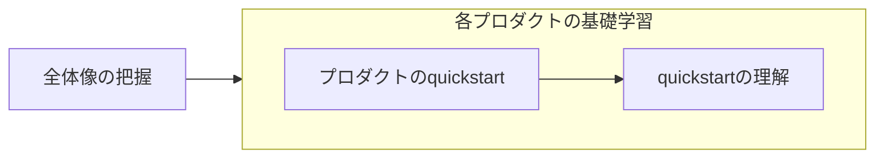

[JP_Google Developer Experts Advent Calendar 2025](https://adventar.org/calendars/11658) の 11 日目の記事です。

# はじめに

クラウドを学びたいけどどう学べばいいかわからない、なんとなく使ってはいるけど基礎がわからず応用がきかない、そんなエンジニアの方々も多いのではないでしょうか？本稿はそんなみなさんにとって Google Cloud の世界を歩き始めるための地図となることを目指しています。

本稿では、これから Google Cloud を学び始めるエンジニアに向けて、学ぶ前に必要な前提知識と学び方を説明します。

Google Cloud を学び始めるすべてのエンジニアの参考になる内容となっていますが、具体的なペルソナは「一人でアプリケーション開発もできるしインターンでも問題なく活躍してきたけどインフラ・クラウドはよくわからん新卒エンジニア」です。

:::details AI にやらせればいいんじゃない？
少なくとも現段階ではクラウドのアーキテクチャ設計や実装を任せられるほど AI は優秀ではありません。AI で効率化することは良いことですが、そのアウトプットが適切かどうかを判断できるようにはなっておくべきです。

柔軟性やスケーラビリティは問題が顕在化してから対応してもなんとかなるケースは多いですが、セキュリティは一発アウトがあり得ます。例えばクラウドの設定を1つ間違えるだけで最近流行りのランサムウェアやサプライチェーンアタックの餌食になり、致命的な損失が発生することもあるでしょう。

筆者も実際に危険な実装や無駄な設計を多く見てきましたが、学び方を知り、学びを重ねることでそのようなミスは確実に減らせると考えています。
:::

# 歩き方

## 全体像の把握

まずは Google Cloud の全体像を概要レベルで把握しましょう。Google Cloud は現段階で 150 以上のプロダクトがあり、すべてを詳細レベルで把握するのは現実的ではありません。概要レベルの雰囲気をなんとなく把握しておき、あるプロダクトを実際に利用したり学んだりするタイミングでより詳しい知識を身につけていくという形で学習を進めていけば大丈夫です。全体像の概要を把握しておけば、何かやりたいことが出たときにそれに関連するプロダクトを学習したり、自分の興味があるプロダクトを見つけて学習したりできます。まずはしっかりと全体像を把握しましょう。

## 各プロダクトの基礎学習

全体像が把握できたら、それぞれのプロダクトを基礎レベルまで学習しましょう。基礎レベルとは、そのプロダクトの概要を理解し、そのプロダクトを自分で設定して利用でき、その設定内容をすべて理解でき、ベストプラクティスを理解している、という段階です。この段階は概ね次のような順序で学習するのがおすすめです。

1. **そのプロダクトの quickstart をやってみる** - ほぼすべてのプロダクトに quickstart という公式のチュートリアルが用意されています。まずはそれを手順通りに実行して実際に動かしてみましょう。
2. **Quickstart の内容を理解する** - quickstart だけではとりあえず触ってみるということしかできないので、次に quickstart の内容を理解しましょう。そのプロダクトは何をするものなのか、quickstart では何をしているのか、quickstart で登場したコードや設定項目の意味、などを理解してください。この段階を踏んで理解を固めることで基礎が身につき応用できるようになります。Quickstart から参照されている公式ドキュメントや AI を活用してください。
3. **ベストプラクティスを学ぶ** - そのプロダクトや使いたい機能のベストプラクティスを学びましょう。この段階でベストプラクティスを完全に習得する必要はなく、一度目を通す程度で問題ありません。実際に利用するときに詳しく確認すれば大丈夫です。利用時にどんな考慮点があるのかということを認識しておきましょう。公式ドキュメントにベストプラクティスが用意されていることもありますし、たいていの場合は AI に聞けば答えてくれます。

内容の理解やベストプラクティスは AI を活用することで効率的に学習を進めることができます。ただし、自分でも公式ドキュメントを参照してダブルチェックするようにしてください。これには 2 つ狙いがあります。まず、誤情報への耐性をつけることです。クラウドは進化が早いため、AI は古い情報を出したり嘘をついたりします。AI でなくとも、ブログ記事などの情報が古くなっていることはよくあります。常に正確な情報を参照する癖をつけておくことで誤情報に振り回されないようになります。次に、ドキュメントへ慣れです。Google Cloud を活用するに当たって**ドキュメントの読み方は必須スキル**です。Google Cloud のドキュメントは量も多く、初めはどのように読めば良いかも難しいので、AI にわからないことを聞きつつ公式ドキュメントをポイントしてもらうことで効率的にドキュメントに慣れていくことができるでしょう。この段階で公式ドキュメントアレルギーを解消しておきましょう。

:::details 応用レベルとは
ここでは基礎レベルについて説明しましたが、では応用レベルとは何でしょうか。例えば、具体的なアーキテクチャに落とし込むことができる、複数のプロダクトの特性を理解し技術選定ができる、複数のプロダクトの最適な組み合わせが判断できる、安定して長期的に運用できる、変化に対応し移行の設計と実行ができる、などが応用レベルのスキルになるでしょう。これらは基礎を身につけた先にある能力です。
:::

## 基礎学習の順番

- とりあえず何か触ってみる
- IAM
- ネットワーク
- 暗号化
- 必要や興味

## 情報収集

## 歩き方まとめ

# 前提知識

## 重要な概念

- プロダクト
- マネージド/Serverless
- API
- 責任共有モデル
- ロケーション

## Google Cloud 用語

# 全体地図

## Google Cloud とは

## プロダクトカテゴリ

150 以上のプロダクトがあるのですべては紹介できない。どのようなカテゴリがあるのかをまず紹介。そして、主要なカテゴリの主要なプロダクトを紹介する。

## プロダクト紹介

### AI/ML

### Infrastructure

# リファレンス

AI は参考にならない。ブログも古くなっていることも多い。信頼できると考えているリソース

- 信頼高い
  - proto 定義
  - API Reference
  - 各種言語の client library
- 信頼度中
  - 公式リファレンス (英語)
- 信頼度低い
  - 上記以外の公式メディア
  - 公式以外のもの
  - リファレンスセンター

# 参考リンク
