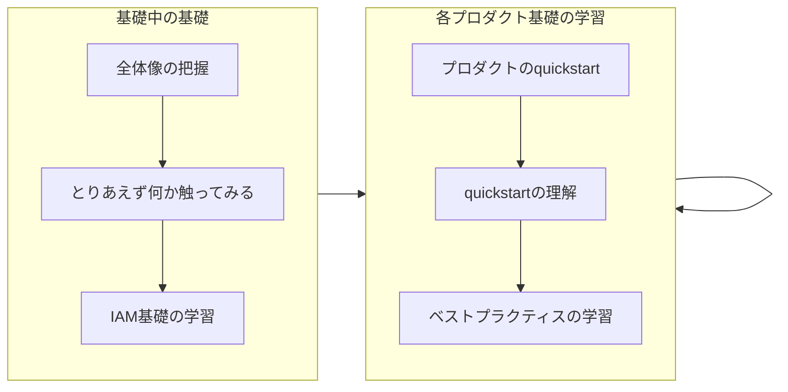

[JP_Google Developer Experts Advent Calendar 2025](https://adventar.org/calendars/11658) の 11 日目の記事です。

# はじめに

クラウドを学びたいけどどう学べばいいかわからない、なんとなく使ってはいるけど基礎がわからず応用がきかない、そんなエンジニアの方々も多いのではないでしょうか？本稿はそんなみなさんにとって Google Cloud の世界を歩き始めるための地図となることを目指しています。

本稿では、これから Google Cloud を学び始めるエンジニアに向けて、学ぶ前に必要な前提知識と学び方を説明します。

Google Cloud を学び始めるすべてのエンジニアの参考になる内容となっていますが、具体的なペルソナは「一人でアプリケーション開発もできるしインターンでも問題なく活躍してきたけどインフラ・クラウドはよくわからん新卒エンジニア」です。

:::details AI にやらせればいいんじゃない？
少なくとも現段階ではクラウドのアーキテクチャ設計や実装を任せられるほど AI は優秀ではありません。AI で効率化することは良いことですが、そのアウトプットが適切かどうかを判断できるようにはなっておくべきです。

柔軟性やスケーラビリティは問題が顕在化してから対応してもなんとかなるケースは多いですが、セキュリティは一発アウトがあり得ます。例えばクラウドの設定を1つ間違えるだけで最近流行りのランサムウェアやサプライチェーンアタックの餌食になり、致命的な損失が発生することもあるでしょう。

筆者も実際に危険な実装や無駄な設計を多く見てきましたが、学び方を知り、学びを重ねることでそのようなミスは確実に減らせると考えています。
:::

# 歩き方

## 全体像の把握

まずは Google Cloud の全体像を概要レベルで把握しましょう。Google Cloud は現段階で 150 以上のプロダクトがあり、すべてを詳細レベルで把握するのは現実的ではありません。概要レベルの雰囲気をなんとなく把握しておき、あるプロダクトを実際に利用したり学んだりするタイミングでより詳しい知識を身につけていくという形で学習を進めていけば大丈夫です。全体像の概要を把握しておけば、何かやりたいことが出たときにそれに関連するプロダクトを学習したり、自分の興味があるプロダクトを見つけて学習したりできます。本稿の後半で説明するので、まずはしっかりと全体像を把握しましょう。

## 公式ドキュメント構造の理解

Google Cloud の学習をする上で最も有用なリソースは Google Cloud 公式のドキュメント群です。公式ドキュメントの構造を理解し、読み方を覚えることで情報獲得のスピードを大きく向上させることができるでしょう。一見すると構造が複雑で欲しい情報にたどり着けないように思える公式ドキュメントですが、構造を覚えると簡単にドキュメントを読めるようになります。詳しい読み方は後述します。

## 各プロダクト基礎の学習

全体像が把握できたら、それぞれのプロダクトを基礎レベルまで学習しましょう。基礎レベルとは、そのプロダクトの概要を理解し、そのプロダクトを自分で設定して利用でき、その設定内容をすべて理解でき、ベストプラクティスを理解している、という段階です。この段階は概ね次のような順序で学習するのがおすすめです。

1. **そのプロダクトの quickstart をやってみる** - ほぼすべてのプロダクトに quickstart や get started という名前で公式のチュートリアルが用意されています。まずはそれを手順通りに実行して実際に動かしてみましょう。
2. **Quickstart の内容を理解する** - quickstart だけではとりあえず触ってみるということしかできないので、次に quickstart の内容を理解しましょう。そのプロダクトは何をするものなのか、quickstart では何をしているのか、quickstart で登場したコードや設定項目の意味、などを理解してください。この段階を踏んで理解を固めることで基礎が身につき応用できるようになります。Quickstart から参照されている公式ドキュメントや AI を活用してください。
3. **ベストプラクティスを学ぶ** - そのプロダクトや使いたい機能のベストプラクティスを学びましょう。この段階でベストプラクティスを完全に習得する必要はなく、一度目を通す程度で問題ありません。実際に利用するときに詳しく確認すれば大丈夫です。利用時にどんな考慮点があるのかということを認識しておきましょう。公式ドキュメントにベストプラクティスが用意されていることもありますし、たいていの場合は AI に聞けば答えてくれます。

内容の理解やベストプラクティスは AI を活用することで効率的に学習を進めることができます。ただし、自分でも公式ドキュメントを参照してダブルチェックするようにしてください。これには 2 つ狙いがあります。まず、誤情報への耐性をつけることです。クラウドは進化が早いため、AI は古い情報を出したり嘘をついたりします。AI でなくとも、ブログ記事などの情報が古くなっていることはよくあります。常に正確な情報を参照する癖をつけておくことで誤情報に振り回されないようになります。次に、ドキュメントへ慣れです。Google Cloud を活用するに当たって**ドキュメントの読み方は必須スキル**です。Google Cloud のドキュメントは量も多く、初めはどのように読めば良いかも難しいので、AI にわからないことを聞きつつ公式ドキュメントをポイントしてもらうことで効率的にドキュメントに慣れていくことができるでしょう。この段階で公式ドキュメントアレルギーを解消しておきましょう。

:::details 応用レベルとは
ここでは基礎レベルについて説明しましたが、では応用レベルとは何でしょうか。例えば、具体的なアーキテクチャに落とし込むことができる、複数のプロダクトの特性を理解し技術選定ができる、複数のプロダクトの最適な組み合わせが判断できる、安定して長期的に運用できる、変化に対応し移行の設計と実行ができる、などが応用レベルのスキルになるでしょう。これらは基礎を身につけた先にある能力です。
:::

## 学習の順序

全体像の把握とドキュメント構造の理解を含め、次の順序で学習するのがおすすめです。

1. **全体像の把握**
2. **公式ドキュメント構造の理解** - 実際に調べる段階にならないとピンとこないこともあるので、まずは流し読みだけでもしておきましょう。実際にドキュメントを読む必要が出たときにまた立ち戻ってください。
3. **とりあえず何か触ってみる** - 何か1つのプロダクトの quickstart をやってみてください。なんでもいいのですが、クセがなく利用頻度も高いので [Cloud Run](https://docs.cloud.google.com/run/docs/quickstarts/deploy-container)、[BigQuery](https://docs.cloud.google.com/bigquery/docs/quickstarts/load-data-console)、[Cloud Storage](https://docs.cloud.google.com/storage/docs/discover-object-storage-console) あたりがおすすめです。
4. **IAM (Identity and Access Management) 基礎の学習** - Google Cloud の基礎中の基礎であり、Google Cloud のすべてのプロダクトで IAM による権限管理が必要になります。IAM を理解せずに Google Cloud は利用できません。他プロダクトの quickstart を進める上でも IAM の知識が必要になるので、まずは IAM の基礎を身につけましょう。
5. **必要なプロダクトや興味のあるプロダクト基礎の学習** - ここからは自分のペースで必要や興味に応じて学習を進めてください

## Appendix: インフラ基礎の学習

:::message
今では古典的なインフラの知識なしで利用できるプロダクトも多いため本稿では Appendix としました。
:::

クラウドを利用すると避けて通れないのがインフラの基礎知識です。特に、ネットワークの知識は欠かせません。Google Cloud のすべての機能はネットワーク経由で利用することになりますし、各プロダクト間の連携もネットワーク経由です。できれば早めにネットワークの基礎知識は身につけておきましょう。

ネットワーク基礎の書籍を何か1冊読んで理解するのが理想ですが、書籍がなくてもTCP、UDP、IPアドレス、L4、L7、サブネット、CIDR、ルーター、プライベートネットワーク、プライベートIPアドレス、グローバルIPアドレス、ロードバランサ、NAT、DNS、VPN、プロキシ、ファイアウォールあたりの単語の意味がわかれば、ドキュメントすら読めないということはだいぶ少なくなるはずです。

# 前提知識

Google Cloud

## 重要な概念

### プロダクト

Google Cloud では Cloud Run や BigQuery のような各製品のことをプロダクトと呼んでいます。ただし、プロダクトの粒度や境界は曖昧なこともあるので、Google Cloud を構成する各パーツぐらいに捉えておけば大丈夫です。

### API

Google Cloud ではほぼすべての機能が API で提供されます。プロダクトとは異なり明確な境界があり、エンドポイントで区別されます。例えば Cloud Run の API は `run.googleapis.com` で提供され、BigQuery の API は `bigquery.googleapis.com` で提供されます。また、基本的に API はユーザーが明示的に有効化して初めて使えるようになります。

Google Cloud を使っていると API についての知識が必要になる場面も多いので、次のドキュメントを一読することをおすすめします。

[Google Cloud API  |  Cloud APIs  |  Google Cloud Documentation](https://docs.cloud.google.com/apis/docs/overview?hl=ja)

基本的には `run.googleapis.com` のような global endpoint を利用しますが、`asia-northeast1-run.googleapis.com` のような locational endpoint や regional endpoint のように地域を限定するためのエンドポイントが利用できる場合もあります。global や regional については後述します。

### ロケーション

場所を表す言葉として、リージョンやゾーンというものがあります。例えば Cloud Run service を asia-northeast1 (東京) リージョンに作成すると、その Cloud Run service は物理的には東京地域で稼働します。

Google Cloud は初期から planet-scale なクラウドであり、ロケーションの考え方が他のクラウドに比べて少し特殊です。次のような概念を理解しておく必要があります。

- **Global リソース** - 地域を限定せず世界中のどこかで稼働するリソースです。[Global external Application Load Balancer](https://docs.cloud.google.com/load-balancing/docs/https#load-balancer-mode) や [Pub/Sub](https://docs.cloud.google.com/pubsub/docs/overview?hl=ja) などが global リソースです。
- **Regional リソース** - 東京リージョンのような、その地域で稼働するリソースです。[Cloud Run service](https://docs.cloud.google.com/run/docs/overview/what-is-cloud-run?hl=ja) や [BigQuery dataset](https://docs.cloud.google.com/bigquery/docs/datasets-intro) などが regional リソースです。
- **Zonal リソース** - ゾーンで稼働するリソースです。ゾーンとはリソースをデプロイする論理的な領域で、概ね3つ以上のゾーンで1つのリージョンが構成されます。基本的に zonal リソースは冗長化をユーザーが構成する必要があります。[Compute Engine instance](https://docs.cloud.google.com/compute/docs/instances?hl=ja) などが zonal リソースです。
- **Dual-regional リソース、Multi-regional リソース** - 可用性を高めるために2つ以上のリージョンで稼働するリソースです。[Cloud Storage](https://docs.cloud.google.com/storage/docs/locations?hl=ja) や [Cloud Spanner](https://docs.cloud.google.com/spanner/docs/instance-configurations?hl=ja) で dual-region や multi-region を選択することができます。

[リージョンとゾーン  |  Compute Engine  |  Google Cloud Documentation](https://docs.cloud.google.com/compute/docs/regions-zones?hl=ja)
[全世界のロケーション - リージョンとゾーン  |  Google Cloud](https://cloud.google.com/about/locations?hl=ja)

## Google Cloud 用語

# 全体地図

## Google Cloud とは

## プロダクトカテゴリ

150 以上のプロダクトがあるのですべては紹介できない。どのようなカテゴリがあるのかをまず紹介。そして、主要なカテゴリの主要なプロダクトを紹介する。

## プロダクト紹介

### AI/ML

### Infrastructure

# リファレンス

AI は参考にならない。ブログも古くなっていることも多い。信頼できると考えているリソース

- 信頼高い
  - proto 定義
  - API Reference
  - 各種言語の client library
- 信頼度中
  - 公式リファレンス (英語)
- 信頼度低い
  - 上記以外の公式メディア
  - 公式以外のもの
  - リファレンスセンター

# 参考リンク
